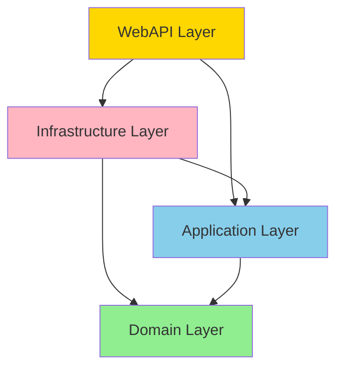

# Architecture Testing Guide

Complete guide for understanding and using architecture tests in FindTheBug.

## What is Architecture Testing?

Architecture testing automatically enforces architectural rules and design patterns in your codebase. Instead of relying on code reviews to catch violations, tests fail if code doesn't follow the defined architecture.

## Quick Start

### Running Tests

```bash
# Run all architecture tests
dotnet test tests/FindTheBug.ArchitectureTests

# Run specific test class
dotnet test --filter "FullyQualifiedName~DependencyTests"

# Run with detailed output
dotnet test tests/FindTheBug.ArchitectureTests --logger "console;verbosity=detailed"
```

### Understanding Test Results

**Passing Test:**
```
✓ Domain_Should_Not_HaveDependencyOnOtherLayers
```
✅ Architecture rule is being followed

**Failing Test:**
```
✗ Commands_Should_EndWithCommand
  Failing types: CreatePatient, UpdatePatient
```
❌ Fix the failing types to follow the naming convention

## Architecture Rules

### Layer Dependencies



**Rules:**
- Domain has NO dependencies
- Application only depends on Domain
- Infrastructure depends on Application and Domain
- WebAPI depends on Application and Infrastructure

### Naming Conventions

| Type | Pattern | Example |
|------|---------|---------|
| Commands | `*Command` | `CreatePatientCommand` |
| Queries | `*Query` | `GetPatientByIdQuery` |
| Handlers | `*Handler` | `CreatePatientCommandHandler` |
| Controllers | `*Controller` | `PatientsController` |
| Interfaces | `I*` | `IRepository<T>` |
| Entities | No `*Entity` suffix | `Patient` ✅ `PatientEntity` ❌ |

### Namespace Organization

```
FindTheBug.Domain
└── Entities/              ← All domain entities

FindTheBug.Application
└── Features/
    └── Patients/
        ├── Commands/      ← Commands here
        └── Queries/       ← Queries here

FindTheBug.WebAPI
├── Controllers/           ← All controllers
└── Middleware/            ← All middleware
```

### CQRS Pattern

**Commands** (write operations):
```csharp
public record CreatePatientCommand(...) : ICommand<Patient>;

public class CreatePatientCommandHandler : ICommandHandler<CreatePatientCommand, Patient>
{
    public async Task<ErrorOr<Patient>> Handle(...) { ... }
}
```

**Queries** (read operations):
```csharp
public record GetPatientByIdQuery(Guid Id) : IQuery<Patient>;

public class GetPatientByIdQueryHandler : IQueryHandler<GetPatientByIdQuery, Patient>
{
    public async Task<ErrorOr<Patient>> Handle(...) { ... }
}
```

### Repository Pattern

**✅ Correct:**
```csharp
public class CreatePatientCommandHandler(IUnitOfWork unitOfWork)
{
    public async Task<ErrorOr<Patient>> Handle(...)
    {
        var patient = new Patient { ... };
        await unitOfWork.Repository<Patient>().AddAsync(patient);
        return patient;
    }
}
```

**❌ Incorrect:**
```csharp
public class CreatePatientCommandHandler(ApplicationDbContext dbContext) // ❌ Don't inject DbContext
{
    public async Task<ErrorOr<Patient>> Handle(...)
    {
        dbContext.Patients.Add(patient); // ❌ Don't use DbContext directly
        await dbContext.SaveChangesAsync();
    }
}
```

## Common Violations and Fixes

### 1. Wrong Naming Convention

**Problem:**
```csharp
public record CreatePatient(...) : ICommand<Patient>; // ❌ Missing "Command" suffix
```

**Fix:**
```csharp
public record CreatePatientCommand(...) : ICommand<Patient>; // ✅
```

### 2. Wrong Namespace

**Problem:**
```csharp
namespace FindTheBug.Application.Commands; // ❌ Wrong namespace

public record CreatePatientCommand(...) : ICommand<Patient>;
```

**Fix:**
```csharp
namespace FindTheBug.Application.Features.Patients.Commands; // ✅

public record CreatePatientCommand(...) : ICommand<Patient>;
```

### 3. Layer Dependency Violation

**Problem:**
```csharp
// In Application layer
using FindTheBug.Infrastructure.Data; // ❌ Application depending on Infrastructure

public class SomeHandler(ApplicationDbContext dbContext) { }
```

**Fix:**
```csharp
// In Application layer
using FindTheBug.Application.Common.Interfaces; // ✅ Use abstraction

public class SomeHandler(IUnitOfWork unitOfWork) { }
```

### 4. Not Using Records for Commands/Queries

**Problem:**
```csharp
public class CreatePatientCommand : ICommand<Patient> // ❌ Should be record
{
    public string FirstName { get; set; }
    public string LastName { get; set; }
}
```

**Fix:**
```csharp
public record CreatePatientCommand( // ✅ Use record
    string FirstName,
    string LastName
) : ICommand<Patient>;
```

### 5. Entity Not Inheriting from Base

**Problem:**
```csharp
public class Patient // ❌ Should inherit from BaseEntity
{
    public Guid Id { get; set; }
}
```

**Fix:**
```csharp
public class Patient : BaseAuditableEntity, ITenantEntity // ✅
{
    // Id is inherited from BaseEntity
}
```

## CI/CD Integration

### GitHub Actions

```yaml
name: Architecture Tests

on: [push, pull_request]

jobs:
  architecture-tests:
    runs-on: ubuntu-latest
    steps:
      - uses: actions/checkout@v3
      - name: Setup .NET
        uses: actions/setup-dotnet@v3
        with:
          dotnet-version: '8.0.x'
      - name: Run Architecture Tests
        run: dotnet test tests/FindTheBug.ArchitectureTests/FindTheBug.ArchitectureTests.csproj
```

### Azure DevOps

```yaml
- task: DotNetCoreCLI@2
  displayName: 'Run Architecture Tests'
  inputs:
    command: 'test'
    projects: 'tests/FindTheBug.ArchitectureTests/FindTheBug.ArchitectureTests.csproj'
```

## Adding New Architecture Rules

### Step 1: Identify the Rule

Example: "All services should end with 'Service'"

### Step 2: Write the Test

```csharp
[Fact]
public void Services_Should_EndWithService()
{
    // Arrange
    var assembly = AssemblyReference.ApplicationAssembly;

    // Act
    var result = Types.InAssembly(assembly)
        .That()
        .ResideInNamespace("FindTheBug.Application.Services")
        .Should()
        .HaveNameEndingWith("Service")
        .GetResult();

    // Assert
    Assert.True(result.IsSuccessful,
        $"All services should end with 'Service'. Failing types: {string.Join(", ", result.FailingTypeNames ?? [])}");
}
```

### Step 3: Run and Verify

```bash
dotnet test tests/FindTheBug.ArchitectureTests
```

## NetArchTest API Reference

### Common Predicates

```csharp
Types.InAssembly(assembly)
    .That()
    .ResideInNamespace("MyNamespace")           // Namespace filter
    .And().AreClasses()                         // Only classes
    .And().AreNotAbstract()                     // Exclude abstract
    .And().HaveNameEndingWith("Command")        // Name pattern
    .And().ImplementInterface(typeof(ICommand<>)) // Interface check
    .Should()
    .HaveDependencyOn("SomeNamespace")          // Dependency check
    .Or().Inherit(typeof(BaseClass))            // Inheritance check
    .GetResult();
```

### Useful Methods

- `ResideInNamespace(string)` - Check namespace
- `HaveNameEndingWith(string)` - Check name suffix
- `HaveNameStartingWith(string)` - Check name prefix
- `ImplementInterface(Type)` - Check interface implementation
- `Inherit(Type)` - Check inheritance
- `HaveDependencyOn(string)` - Check dependencies
- `NotHaveDependencyOn(string)` - Ensure no dependency

## Best Practices

1. **One Rule Per Test** - Keep tests focused
2. **Clear Error Messages** - Include failing type names
3. **Run Frequently** - Add to pre-commit hooks
4. **Document Exceptions** - If a rule has exceptions, document why
5. **Keep Tests Fast** - Architecture tests should run in seconds

## Troubleshooting

### Test Fails But Code Looks Correct

Check:
- Namespace is exactly as expected
- Type name matches the pattern
- No typos in test configuration

### Test Passes But Shouldn't

Check:
- Test is actually running (not skipped)
- Predicate filters are correct
- Assembly reference is correct

### Performance Issues

- Use specific namespace filters
- Avoid checking entire assemblies when possible
- Cache assembly references

## Resources

- [NetArchTest Documentation](https://github.com/BenMorris/NetArchTest)
- [Clean Architecture by Robert C. Martin](https://blog.cleancoder.com/uncle-bob/2012/08/13/the-clean-architecture.html)
- [CQRS Pattern](https://martinfowler.com/bliki/CQRS.html)
