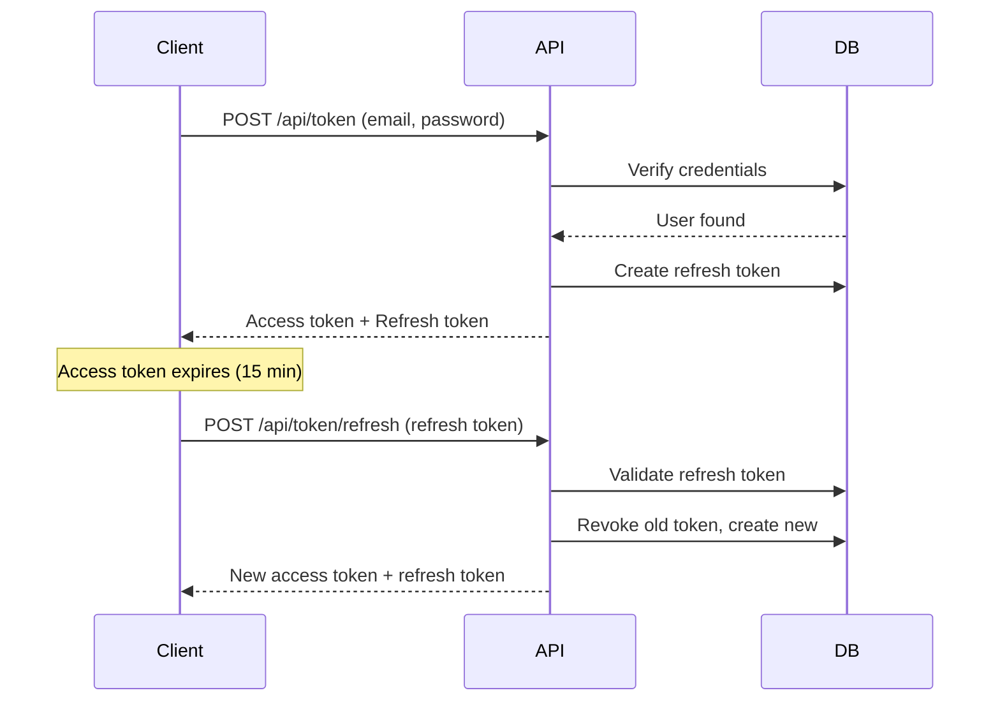

# JWT Authentication Guide

Complete guide for using the JWT authentication system in FindTheBug.

## Quick Start

### 1. Configuration

Update `appsettings.json` with your settings:

```json
{
  "Jwt": {
    "SecretKey": "your-secret-key-at-least-32-characters",
    "AccessTokenExpirationMinutes": "15"
  },
  "Email": {
    "SmtpHost": "smtp.gmail.com",
    "SmtpPort": "587",
    "SmtpUsername": "your-email@gmail.com",
    "SmtpPassword": "your-app-password"
  }
}
```

### 2. Authentication Flow



### 3. API Endpoints

#### Login
```bash
curl -X POST https://localhost:5001/api/token \
  -H "Content-Type: application/json" \
  -d '{"email":"user@example.com","password":"password123"}'
```

#### Refresh Token
```bash
curl -X POST https://localhost:5001/api/token/refresh \
  -H "Content-Type: application/json" \
  -d '{"refreshToken":"your-refresh-token"}'
```

#### Change Password
```bash
curl -X POST https://localhost:5001/api/token/change-password \
  -H "Authorization: Bearer your-access-token" \
  -H "Content-Type: application/json" \
  -d '{"currentPassword":"old","newPassword":"new123"}'
```

#### Request Password Reset
```bash
curl -X POST https://localhost:5001/api/token/request-reset \
  -H "Content-Type: application/json" \
  -d '{"email":"user@example.com"}'
```

#### Reset Password
```bash
curl -X POST https://localhost:5001/api/token/reset-password \
  -H "Content-Type: application/json" \
  -d '{"token":"reset-token","newPassword":"newpass123"}'
```

#### Logout
```bash
curl -X POST https://localhost:5001/api/token/revoke \
  -H "Authorization: Bearer your-access-token" \
  -H "Content-Type: application/json" \
  -d '{"refreshToken":"your-refresh-token"}'
```

## Security Features

### Account Lockout
- 5 failed attempts → 15-minute lockout
- Automatic unlock after timeout
- Counter resets on successful login

### Token Security
- Access tokens: 15-minute expiration
- Refresh tokens: 7-day expiration
- Token rotation on refresh
- Revocation tracking with IP addresses

### Password Security
- BCrypt hashing (work factor: 12)
- Minimum 8 characters
- All tokens revoked on password change

### Password Reset
- Secure random tokens (32 bytes)
- 1-hour expiration
- Single-use only
- Email enumeration prevention

## Client Implementation

### JavaScript/TypeScript Example

```typescript
class AuthService {
  private accessToken: string | null = null;
  private refreshToken: string | null = null;

  async login(email: string, password: string) {
    const response = await fetch('/api/token', {
      method: 'POST',
      headers: { 'Content-Type': 'application/json' },
      body: JSON.stringify({ email, password })
    });

    const result = await response.json();
    if (result.isSuccess) {
      this.accessToken = result.data.accessToken;
      this.refreshToken = result.data.refreshToken;
      localStorage.setItem('refreshToken', this.refreshToken);
    }
    return result;
  }

  async refreshAccessToken() {
    const refreshToken = localStorage.getItem('refreshToken');
    if (!refreshToken) return false;

    const response = await fetch('/api/token/refresh', {
      method: 'POST',
      headers: { 'Content-Type': 'application/json' },
      body: JSON.stringify({ refreshToken })
    });

    const result = await response.json();
    if (result.isSuccess) {
      this.accessToken = result.data.accessToken;
      this.refreshToken = result.data.refreshToken;
      localStorage.setItem('refreshToken', this.refreshToken);
      return true;
    }
    return false;
  }

  async authenticatedRequest(url: string, options: RequestInit = {}) {
    options.headers = {
      ...options.headers,
      'Authorization': `Bearer ${this.accessToken}`
    };

    let response = await fetch(url, options);

    // If 401, try to refresh token
    if (response.status === 401) {
      const refreshed = await this.refreshAccessToken();
      if (refreshed) {
        options.headers = {
          ...options.headers,
          'Authorization': `Bearer ${this.accessToken}`
        };
        response = await fetch(url, options);
      }
    }

    return response;
  }

  async logout() {
    await fetch('/api/token/revoke', {
      method: 'POST',
      headers: {
        'Authorization': `Bearer ${this.accessToken}`,
        'Content-Type': 'application/json'
      },
      body: JSON.stringify({ refreshToken: this.refreshToken })
    });

    this.accessToken = null;
    this.refreshToken = null;
    localStorage.removeItem('refreshToken');
  }
}
```

## Protecting Endpoints

Add `[Authorize]` attribute to controllers or actions:

```csharp
[ApiController]
[Route("api/patients")]
[Authorize] // Requires authentication
public class PatientsController : ControllerBase
{
    [HttpGet]
    public async Task<IActionResult> GetAll() { ... }

    [HttpPost]
    [Authorize(Roles = "Admin")] // Requires Admin role
    public async Task<IActionResult> Create() { ... }
}
```

## Troubleshooting

### "JWT SecretKey not configured"
- Ensure `Jwt:SecretKey` is set in appsettings.json
- Key must be at least 32 characters for HS256

### Email not sending
- Check SMTP settings in appsettings.json
- For Gmail, use App Password, not regular password
- Verify firewall allows SMTP port (587)

### Token validation fails
- Check token hasn't expired
- Verify Issuer and Audience match configuration
- Ensure clock skew is acceptable

### Account locked
- Wait 15 minutes for automatic unlock
- Or manually update `LockedOutUntil` in database

## Best Practices

1. **Store refresh tokens securely**
   - Use httpOnly cookies or secure storage
   - Never expose in URLs or logs

2. **Rotate secrets regularly**
   - Change JWT secret key periodically
   - Invalidate all tokens when rotating

3. **Monitor failed logins**
   - Track failed attempts per IP
   - Alert on suspicious patterns

4. **Use HTTPS only**
   - Never send tokens over HTTP
   - Enable HSTS headers

5. **Implement token cleanup**
   - Remove expired refresh tokens
   - Remove old password reset tokens

## Additional Resources

- [JWT.io](https://jwt.io/) - JWT debugger
- [OWASP Authentication Cheat Sheet](https://cheatsheetseries.owasp.org/cheatsheets/Authentication_Cheat_Sheet.html)
- [Microsoft Identity Documentation](https://learn.microsoft.com/en-us/aspnet/core/security/authentication/)
